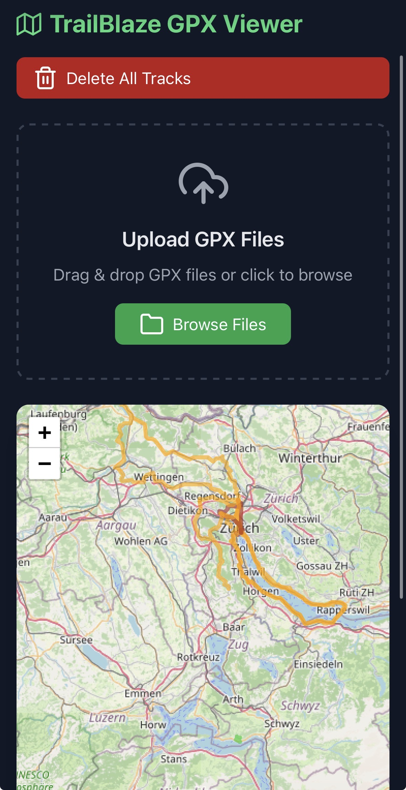
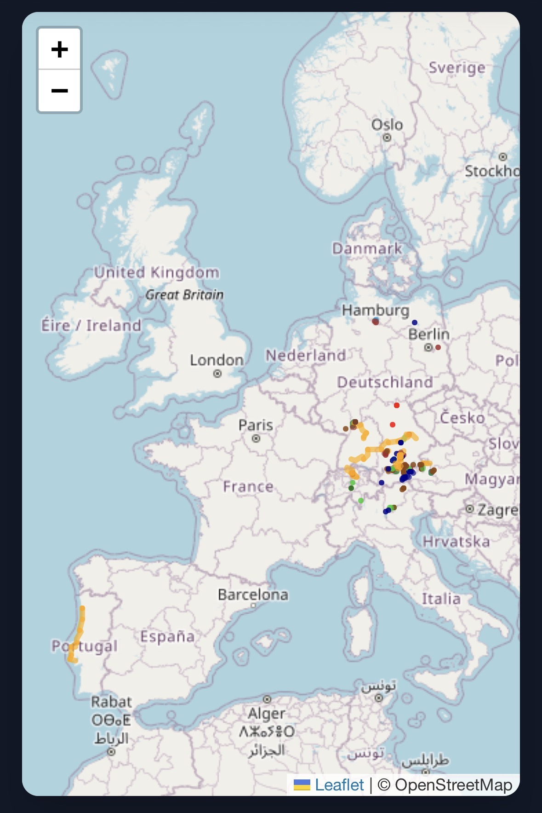

# TrailBlaze — GPX Viewer

A high-performance, aesthetically refined GPX track visualizer.  
Upload, analyze, and manage your outdoor adventures through a seamless web interface.




## 🚀 Key Features

- **Blazing Fast Visualization**: Optimized for performance with on-the-fly Ramer-Douglas-Peucker (RDP) geometry simplification, reducing massive track data into lightweight, visually accurate map paths.
- **Intelligent Caching**: Advanced ETag-based caching with versioned payloads ensures near-instant repeat loads and zero redundant data transfer.
- **Performance Optimized**: Audited for Lighthouse performance with asynchronous asset loading, LCP priority preloading, and minimal render-blocking requests.
- **Rich Track Stats**: Automatic calculation of total 2D distance and cumulative elevation gain (uphill) for every track using high-precision `gpxpy` algorithms.
- **Modern UI**: Dark-themed, forest-inspired interface with responsive controls, fullscreen map mode, and intuitive drag-and-drop uploading.
- **Robust Storage**: Built on PostGIS for high-accuracy spatial data storage and retrieval, persisting your entire history across sessions.

## 🛠️ Built With

- **Backend**: [FastAPI](https://fastapi.tiangolo.com/) (Python)
- **Database**: [PostGIS](https://postgis.net/) (PostgreSQL + Spatial Extensions)
- **Frontend**: [Leaflet.js](https://leafletjs.com/), [TailwindCSS](https://tailwindcss.com/), [Feather Icons](https://feathericons.com/)
- **Processing**: [gpxpy](https://github.com/tkrajina/gpxpy), [Shapely](https://shapely.readthedocs.io/)
- **Infrastructure**: [Docker Compose](https://www.docker.com/)

## 🏁 Getting Started

### Prerequisites

- [Docker Desktop](https://www.docker.com/products/docker-desktop/) or Docker Engine with Compose.

### Quick Start

1. **Clone and Enter**:
   ```bash
   git clone https://github.com/wenzelt/trailblaze-gpx-viewer.git
   cd trailblaze-gpx-viewer
   ```

2. **Configure Environment (Optional)**:
   For local development, the app works out-of-the-box with default values. To customize them, copy the example file:
   ```bash
   cp .env.example .env
   ```

3. **Launch Services**:
   ```bash
   docker compose up --build
   ```

4. **Explore**:
   Open [**http://localhost:8008**](http://localhost:8008) in your browser.

## 📖 How It Works

### Uploading Tracks
Simply drag and drop one or more `.gpx` files onto the upload zone. The app performs a SHA-256 hash check to prevent duplicates before computing stats and storing the geometry in PostGIS.

### Activity Categories & Tagging
TrailBlaze supports automatic activity categorization and color-coding based on your filenames. To categorize a track, name your file using the format `any-name-category.gpx` (e.g., `morning-run-running.gpx`). For categories with multiple words, use an underscore (e.g., `forest-trail-trail_running.gpx`).

Supported categories include:

- **🏃 Endurance**: `running` (Red), `trail_running` (Dark Red), `cycling` (Orange), `mountain_biking` (Dark Orange), `walking` (Brown), `trekking`, `triathlon`.
- **🌊 Water**: `swimming` (Blue), `open_water_swimming`, `kayaking` (Sky Blue), `canoeing`, `rowing`, `sailing`, `diving`.
- **🏔️ Mountain**: `hiking` (Green), `mountaineering` (Dark Green), `climbing`, `bouldering`, `skiing_touring`, `cross_country_skiing`.
- **❄️ Winter**: `alpine_skiing` (Cyan), `snowboarding`, `ice_skating`, `ice_hockey`.
- **💪 Fitness**: `crossfit` (Purple), `strength_training`, `aerobics`, `hiit`, `gym`.
- **🧘 Mind & Body**: `yoga` (Gold), `pilates`, `meditation`.
- **🛠️ Misc**: `chores` (Gray), `other` (Black).

Tracks without a recognized category default to a deep blue color.

### Efficient Rendering & Performance
To maintain a smooth 60fps experience even with thousands of tracks, TrailBlaze simplifies geometries on-the-fly when serving the API using the Ramer-Douglas-Peucker algorithm. This removes redundant GPS "noise" while preserving the exact path of your adventure. The frontend is further optimized for low-latency loading by eliminating render-blocking CSS and utilizing `fetchpriority` for critical map assets.

### Caching Strategy
The `/tracks` endpoint uses a versioned cache. If no data has changed, the server returns a `304 Not Modified` in milliseconds. If changes occur, the server sends a pre-serialized binary payload, bypassing heavy JSON encoding and ensuring the fastest possible delivery to the browser.

## ⚙️ Configuration

Environment variables can be tuned in `.env`:

| Variable | Default | Description |
|----------|---------|-------------|
| `MAX_UPLOAD_MB` | `50` | Maximum allowed GPX file size |
| `GEOM_SIMPLIFY_TOLERANCE` | `0.0001` | RDP simplification threshold (approx. 11m) |
| `DB_DSN` | *(derived)* | PostGIS connection string |

## 🤝 Contributing

Contributions are welcome! Please feel free to submit a Pull Request.

## 📜 License

Distributed under the MIT License. See `LICENSE` for more information.
